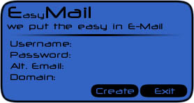



## EasyEmail

### Description

This program was made to make email accounts very fast. You have the option of choosing from 176 domains to make user@domain.com. All you have to input is a username, pw, and another email that they can send you your forgotten pw. Please comment. I used dssock32.ocx for the winsock to make this.
 
### More Info
 

             |
---                |---
**Submitted On**   |1999-12-05 00:17:10
**By**             |[Quinton Hett](https://github.com/Planet-Source-Code/PSCIndex/blob/master/ByAuthor/quinton-hett.md)
**Level**          |Unknown
**User Rating**    |4.2 (161 globes from 38 users)
**Compatibility**  |VB 5\.0, VB 6\.0
**Category**       |[Miscellaneous](https://github.com/Planet-Source-Code/PSCIndex/blob/master/ByCategory/miscellaneous__1-1.md)
**World**          |[Visual Basic](https://github.com/Planet-Source-Code/PSCIndex/blob/master/ByWorld/visual-basic.md)
**Archive File**   |[CODE\_UPLOAD21181251999\.zip](https://github.com/Planet-Source-Code/quinton-hett-easyemail__1-4739/archive/master.zip)

